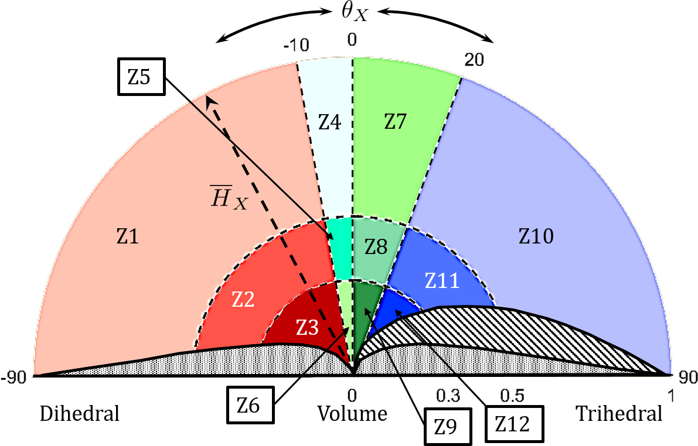

# Scattering type parameter extraction and a novel clustering scheme for full (FP) and compact (CP) polarimetric SAR data

## General information
This code performs an unsupervised clustering using the parameters  ,  for FP and ,  for CP data.  and  are the target charactization parameters for FP and CP data, given as,

=\frac{m_{\text{FP}}{\text{Span}}\left(T_{11}-T_{22}-T_{33}\right)}{T_{11}\left(T_{22}+T_{33}\right)+m_{\text{FP}}^{2}{\text{Span}}^{2})

=\left(\frac{m_{\text{CP}}\,{\text{Span}}\left(OC-SC\right)}{{OC}\times{SC}+m_{\text{CP}}^2{\text{Span}}^{2}}\right))

Here, ,  and  are diagonal elements of `T3` matrix. SC and OC are defined as, 

 

and, 

; 

 and  are Stokes elements of CP SAR data.  and  are 3D and 2D Barakat degree of polarizations.

\big)^3}})

\big)^2}})

## Clustering illustration

  

The shaded areas are non-feasible regions. Please follow this article for more details:  https://doi.org/10.1016/j.isprsjprs.2020.09.010.

## Up and running
This is a `MATLAB` based code. To run the code the coherency matrix elements (`T3`) for `FP` and covariance matrix elements (`C2`) for `CP` are required.

**N. B.** 
- The T3 and C2 matrix elements should be exported in PolSARpro format and the T3 or C2 directory should contain a "config.txt" file as generated by PolSARpro
- Please specify the window size for processing

In addition to this for CP:

- Please specify the Chi value for processing: for right circular transmit it is -45 and for left circular transmit it is +45
- Please specify the Psi for processing: for CP it is 0

- Please use `FP_target_characterization_clustering.m` or, `CP_target_characterization_clustering.m` to perform unsupervised clustering of FP or, CP data.
## References

- S. Dey, A. Bhattacharya, D. Ratha, D. Mandal and A. C. Frery, "Target Characterization and Scattering Power Decomposition for Full and Compact Polarimetric SAR Data," in IEEE Transactions on Geoscience and Remote Sensing, doi: https://doi.org/10.1109/TGRS.2020.3010840

- S. Dey, A. Bhattacharya, D. Ratha, D. Mandal,  H. McNairn, J.M. Lopez-Sanchez, and Y.S. Rao, 2020. "Novel clustering schemes for full and compact polarimetric SAR data: An application for rice phenology characterization". ISPRS Journal of Photogrammetry and Remote Sensing, 169, pp.135-151, https://doi.org/10.1016/j.isprsjprs.2020.09.010.
